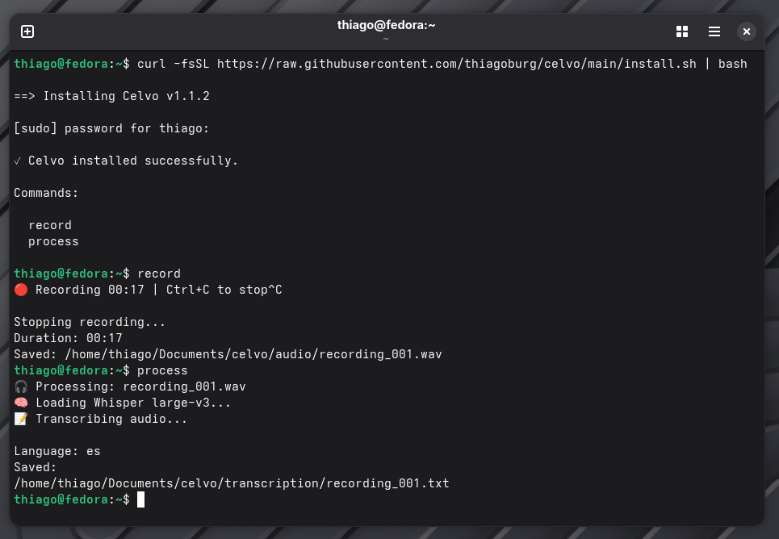
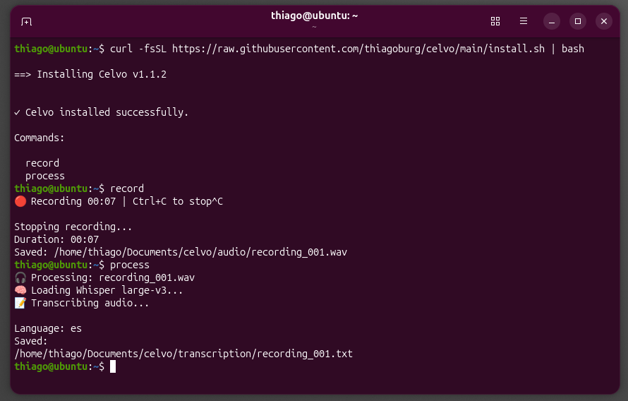

# Celvo


Private, offline audio recording and transcription tool for Linux.

Built on `whisper.cpp` for high-quality local transcription.

Celvo records audio locally and generates accurate transcriptions completely offline.

Your recordings never leave your machine.

---

# Installation

## Quick install

Copy and paste this into your terminal:

```bash
curl -fsSL https://raw.githubusercontent.com/thiagoburg/celvo/main/install.sh | bash
```

The installer automatically:

- Detects your Linux distribution
- Installs required dependencies
- Creates the Python environment
- Builds `whisper.cpp`
- Downloads the Whisper large-v3 model
- Creates the `record` and `process` commands

The first installation takes a few minutes because it compiles `whisper.cpp` and downloads the transcription model.

After installation, the commands are available immediately:

```bash
record
```

Record your audio.

Then:

```bash
process
```

Generate your transcription.

> **Fresh installations**
>
> If `curl` is not installed:
>
> ```bash
> sudo apt update
> sudo apt install -y curl
> ```
>
> Then run:
>
> ```bash
> curl -fsSL https://raw.githubusercontent.com/thiagoburg/celvo/main/install.sh | bash
> ```

---

# Tested systems

## Fedora Linux

Validated from a clean Fedora installation.



## Ubuntu Linux

Validated from a clean Ubuntu installation.



---

# Future systems

Planned validation includes:

- Debian
- Linux Mint
- Pop!_OS
- Arch Linux
- openSUSE
- EndeavourOS
- elementary OS
- Zorin OS
- Other mainstream Linux distributions

---

# Features

- Local audio recording
- Offline AI transcription
- Powered by `whisper.cpp`
- Whisper Large-v3 quantized model
- No cloud services
- No API keys
- No subscriptions
- Simple command-line interface
- High-quality transcription

Celvo is designed for transcription quality, privacy and reliability.

It does not summarize, rewrite, or interpret conversations.

---

# Privacy

Everything runs locally.

Your audio is:

- recorded locally
- processed locally
- transcribed locally

Nothing is uploaded to external servers.

No internet connection is required after installation.

Internet access is only required during the initial installation to download dependencies and the transcription model.

---

# How it works

Celvo follows a simple workflow:

1. Record audio.
2. Save the recording locally.
3. Process the recording with `whisper.cpp`.
4. Generate a text transcription.

Everything happens on your own computer.

---

# Requirements

Celvo requires:

- Supported Linux distribution
- `sudo`
- Internet connection for the first installation only
- At least 3 GB of free disk space during installation

All required packages are installed automatically.

---

# Technology

Celvo is built with:

- Python
- `whisper.cpp`
- Whisper Large-v3
- sounddevice
- numpy
- scipy
- requests
- ffmpeg

---

# Architecture

Celvo follows a simple local-first architecture:

```text
Microphone/System Audio
        │
        ▼
Audio Recorder
        │
        ▼
Local WAV file
        │
        ▼
whisper.cpp
        │
        ▼
Text transcription
```

Everything runs entirely on your own machine.

---

# Project structure

```text
celvo/
├── celvo/
├── docs/
│   └── images/
├── .github/
├── install.sh
├── setup.sh
├── requirements.txt
├── pyproject.toml
├── README.md
├── CHANGELOG.md
├── CONTRIBUTING.md
├── CODE_OF_CONDUCT.md
└── LICENSE
```

---

# Roadmap

Upcoming improvements:

- Debian validation
- Linux Mint validation
- Pop!_OS validation
- Arch Linux validation
- openSUSE validation
- Better documentation
- More automated testing
- Performance improvements
- Stable v1.x releases

---

# Project status

Current version: **v1.2.2**

Validated on clean Fedora and Ubuntu installations.

Support for additional mainstream Linux distributions is planned.

---

# Contributing

Contributions are welcome.

See `CONTRIBUTING.md`.

---

# Issues

Found a bug? Please open a GitHub Issue.

---

# License

MIT License
