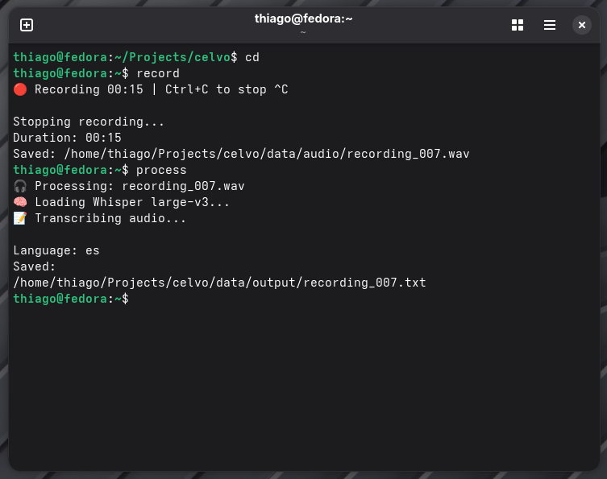

# Celvo

Private offline speech transcription tool.

Celvo records audio and converts it into accurate text using local AI models.
All processing happens on the user's machine, without cloud services or external accounts.

## Overview

Most transcription services require uploading audio to external servers.

Celvo provides a local alternative focused on:

- Privacy
- Transcription quality
- Simple workflow
- No dependency on cloud APIs

## Features

- Local audio recording
- Offline transcription
- Whisper large-v3 model support
- Linux native workflow
- No external API keys required
- Open source components

## How it works

Audio recording
        |
        v
Audio processing
        |
        v
Whisper large-v3
        |
        v
Text transcription

## Installation

Clone the repository:

    git clone https://github.com/thiagoburg/celvo.git
    cd celvo

Run the installer:

    ./install.sh

The installer will:

- Install required dependencies
- Build whisper.cpp
- Download the transcription model
- Configure the command line interface

## Usage

Record audio:

    celvo record

Process the recording:

    celvo process

## Example

Input:

    recording_001.wav

Output:

    recording_001.txt

## Architecture

Celvo uses a local processing pipeline designed around privacy and simplicity.

The workflow is:

    Audio sources
        |
        +----------------+
        |                |
        v                v
    Microphone      System audio
        |                |
        +----------------+
                 |
                 v
          Audio recording
                 |
                 v
             WAV file
                 |
                 v
           whisper.cpp
                 |
                 v
      Whisper large-v3 model
                 |
                 v
        Text transcription

The entire process runs locally on the user's machine.
Audio files are not uploaded to external services.

## Technology

Celvo is built using:

- Python
- C++
- whisper.cpp
- Whisper large-v3
- Linux audio tools

## Project Structure

    celvo/
    ├── core/
    │   ├── recorder.py
    │   ├── processor.py
    │   ├── whisper.py
    │   ├── microphone.py
    │   ├── system_audio.py
    │   ├── mixer.py
    │   ├── files.py
    │   └── config.py
    │
    ├── main.py
    ├── __main__.py
    ├── models/
    ├── data/
    └── install.sh

## Roadmap

Possible future improvements:

- Real-time transcription
- Desktop application
- Improved audio processing
- Automatic language detection

## About

Celvo is a software project focused on building practical offline AI applications using open source technologies.

Author:

Thiago Burg

## Demo

